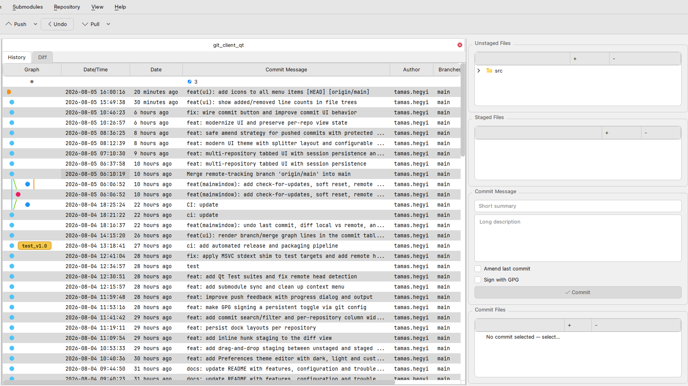

# GitClientQt

A lightweight, full-featured desktop Git client built with Qt.

## Screenshot



## Description

GitClientQt is a desktop Git GUI that wraps the standard `git` command-line tool
in a three-pane interface. It lets you browse branches, tags, stashes and
submodules, inspect the commit graph, stage/unstage files, view diffs and blame
information, merge, rebase, cherry-pick, bisect, archive — all without leaving
the application.

Your existing Git setup (SSH keys, GPG signing, hooks, LFS, submodules) works
unchanged because GitClientQt delegates every operation to the `git` binary.

---

## Build

```bash
cmake -B build -S .
cmake --build build
```

## Install

```bash
./build/GitClientQt          # run directly
sudo cp build/GitClientQt /usr/local/bin/   # or install system-wide
```

No additional runtime files are required beyond the Qt libraries and a `git`
installation on your `PATH`.

## Requirements

- Qt 5 (QtCore, QtGui, QtWidgets)
- CMake ≥ 3.16
- `git` on the system `PATH`

## Tests

```bash
cd build && ctest --output-on-failure
```

---

## Window Layout

| Area | Content |
|------|---------|
| **Left dock** | Repository explorer: local/remote branches, tags, stashes, submodules, worktrees |
| **Center** | Commit table (graph, date, message, author, email, branches, SHA, stats, GPG) |
| **Right dock** | Working tree (staged / unstaged / untracked files), commit files for selected commit |
| **Bottom** | Diff view (unified or side-by-side), command log tab |
| **Toolbar** | Push, Pull, Undo, Filter |
| **Status bar** | Current branch, ahead/behind counts, operation feedback |

---

## Menu Reference

### File Menu

| Action | Shortcut | Description |
|--------|----------|-------------|
| Clone Repository | `Ctrl+Shift+N` | Clone a remote repository to a local directory |
| Initialize Repository | `Ctrl+N` | Create a new empty Git repository |
| Open Repository | `Ctrl+O` | Open an existing local Git repository |
| Recent Repositories | — | Quick access to previously opened repositories |
| Close Repository | `Ctrl+W` | Close the current repository and return to welcome state |
| Exit | `Ctrl+Q` | Quit the application |

### Edit Menu

| Action | Shortcut | Description |
|--------|----------|-------------|
| Edit .gitignore | `Ctrl+Shift+I` | Open the repository's `.gitignore` in an editor |
| Edit .gitattributes | `Ctrl+Shift+A` | Open the repository's `.gitattributes` in an editor |
| Preferences | `Ctrl+,` | Open the settings dialog (general, shortcuts, window state) |

### Search Menu

| Action | Shortcut | Description |
|--------|----------|-------------|
| Grep | `Ctrl+Shift+G` | Search for a text pattern across the repository (git grep) |

### Submodules Menu

| Action | Description |
|--------|-------------|
| Init | Initialize configured submodules (`git submodule init`) |
| Update | Update registered submodules (`git submodule update`) |
| Sync | Sync submodule remote URLs (`git submodule sync`) |
| Add... | Add a new submodule (prompts for URL and path) |
| Open... | Open the selected submodule in a new tab |

### Repository Menu

| Action | Shortcut | Description |
|--------|----------|-------------|
| Settings... | `Ctrl+,` | Configure repository-specific settings (user name, email, etc.) |
| Commit hooks and templates... | `Ctrl+Shift+H` | Edit commit message template and manage hooks |
| Apply patch... | `Ctrl+Shift+P` | Apply a `.patch` or `.diff` file to the working tree |
| Reflog | `Ctrl+Shift+R` | Browse the reference log; double-click to jump to a commit |
| Diff local vs remote | — | Show the diff between the local HEAD and its upstream |
| Undo last commit | — | Soft-reset the most recent commit, keeping changes staged |
| Merge branch... | `Ctrl+M` | Merge another branch into the current branch with strategy selection and conflict preview |
| Resolve conflicts... | `Ctrl+Shift+C` | Open the interactive conflict resolver |
| **Bisect** submenu | | |
| &nbsp;&nbsp;Start... | — | Start a bisect session (prompts for good/bad refs) |
| &nbsp;&nbsp;Good | — | Mark the current commit as good |
| &nbsp;&nbsp;Bad | — | Mark the current commit as bad |
| &nbsp;&nbsp;Skip | — | Skip the current commit |
| &nbsp;&nbsp;Reset | — | End the bisect session |
| **LFS** submenu | | |
| &nbsp;&nbsp;Track pattern... | — | Track a new file pattern with Git LFS |
| &nbsp;&nbsp;Untrack pattern... | — | Remove a tracked LFS pattern |
| &nbsp;&nbsp;Pull objects | — | Download LFS objects from the remote |
| &nbsp;&nbsp;Push objects | — | Upload local LFS objects to the remote |
| Create archive... | — | Export the repository as a `.zip`, `.tar.gz`, or `.tar` archive |
| Rebase --onto... | — | Rebase a range of commits onto a different base |

### Help Menu

| Action | Description |
|--------|-------------|
| Check for Updates... | Query GitHub for the latest release |

---

## Toolbar Reference

### Remote Toolbar

| Button | Shortcut | Description |
|--------|----------|-------------|
| **Push** | `Ctrl+Shift+P` | Push the current branch to its remote |
| Push ▾ (dropdown) | — | Select push mode: normal, force push, or push with lease |
| **Pull** | `Ctrl+Shift+L` | Pull/fetch from the remote |
| Pull ▾ (dropdown) | — | Select pull mode: fast-forward if possible, fast-forward only, rebase, or fetch all |
| Fetch from... | — | Fetch from a specific remote |
| Fetch all | `Ctrl+Shift+F` | Fetch all configured remotes |
| **Undo** | `Ctrl+Shift+Z` | Undo the last commit (soft reset) |

### Filter Toolbar

Type in the filter field to narrow the commit table:

- Plain text — matches against commit message, author name, branch, or SHA
- `file:<pattern>` — shows only commits that touched files matching the pattern

---

## Commit Table

The commit table displays the following columns (togglable via right-click on the header):

| Column | Content |
|--------|---------|
| Graph | Visual commit graph with lane rendering and tag badges |
| Date/Time | Absolute date/time of the commit |
| Date | Relative date (e.g. "2 hours ago") |
| Commit Message | Subject line with HEAD/remote markers and push/pull indicators |
| Author | Author name |
| Author Email | Author email address (hidden by default) |
| Branches | Branch associated with the commit |
| SHA | Abbreviated commit hash (monospace) |
| Stats | Insertions/deletions count: `+N -M` (hidden by default) |
| GPG | Signature status: ✔ good, ✘ bad, ? unknown key, ! expired (hidden by default) |

### Commit Table Context Menu (single commit)

| Action | Description |
|--------|-------------|
| Checkout this Commit | Detach HEAD at the selected commit |
| Create branch from this commit | Create a new branch starting at the commit |
| Create Tag for this Commit | Tag the commit |
| Diff with another commit | Compare the commit against another chosen commit |
| Interactive rebase from here | Start `git rebase -i` from this point |
| Cherry-pick this commit | Apply the commit onto the current branch |
| Revert this commit | Create a revert commit |
| Squash with previous | Squash into the preceding commit (via interactive rebase) |
| Fixup into previous | Fixup into the preceding commit |
| Reset to this commit | Reset the current branch to this commit (hard/mixed/soft) |
| Save as patch... | Export the commit as a `.patch` file |
| Copy → Full SHA / Short SHA / Subject / Author | Copy metadata to clipboard |
| Undo last commit (soft) | Available only on HEAD — soft-resets the last commit |

### Commit Table Context Menu (multi-select, 2+ commits)

| Action | Description |
|--------|-------------|
| Compare range | Show a diff between the oldest and newest selected commits |
| Batch cherry-pick | Cherry-pick all selected commits onto the current branch |
| Copy SHAs | Copy all selected SHAs to clipboard |

---

## Working Tree Panel

### Unstaged Files Context Menu

| Action | Description |
|--------|-------------|
| Stage | Stage the file or folder |
| Stash file/folder | Stash changes for the selected path |
| Discard changes | Discard local modifications |
| Ignore (add to .gitignore) | Add the path to `.gitignore` |
| Blame | Open per-line blame view |
| Stage hunks | Interactively stage individual hunks |
| Open in external diff tool | Launch the configured diff tool |
| Open in External Editor | Open in the system editor |
| Open Containing Folder | Open the parent directory in the file manager |
| Revert to HEAD | Restore the file to the HEAD version |
| Git rm | Remove the file from the repository |
| Git mv | Rename/move the file |
| Git clean | Remove untracked files |

### Staged Files Context Menu

| Action | Description |
|--------|-------------|
| Unstage | Remove the file from the staging area |
| Unstage hunk | Interactively unstage individual hunks |

### Untracked Files Context Menu

| Action | Description |
|--------|-------------|
| Stage | Stage the untracked file |
| Discard | Remove the untracked file |
| Ignore | Add to `.gitignore` |

---

## Commit Files Panel

When a commit is selected, the right dock shows files changed in that commit.

### Context Menu

| Action | Description |
|--------|-------------|
| View diff in external diff tool | Open the file diff in the configured tool |
| Blame | Open the blame view for this file at this commit |
| File History | Show all commits that touched this file |
| Checkout this version | Restore this file to the version from the selected commit |
| Open in External Editor | Open the file in the system editor |
| Open Containing Folder | Open the parent directory |

---

## Branch Context Menu (left panel)

| Action | Description |
|--------|-------------|
| Checkout | Switch to the selected branch |
| Merge into current | Merge the branch into the current HEAD |
| Rebase current onto this | Rebase the current branch onto the selected branch |
| Delete branch | Delete the local branch |
| Rename branch | Rename the local branch |
| Push branch | Push the branch to its tracked remote |
| Pull branch | Pull updates for the branch |
| Copy branch name | Copy the branch name to clipboard |

---

## Stash Context Menu (left panel)

| Action | Description |
|--------|-------------|
| Apply | Apply the stash without removing it |
| Pop | Apply and remove the stash |
| Drop | Delete the stash |
| Show | Show the diff contained in the stash |

---

## Worktree Context Menu (left panel)

| Action | Description |
|--------|-------------|
| Add worktree... | Create a new linked worktree |
| Open | Open the worktree as a repository |
| Remove | Remove the linked worktree |

---

## Diff View

- **Unified mode** (default): standard unified diff with color-coded additions/deletions
- **Side-by-side mode**: two-column comparison view
- **Hunk staging links**: click "stage hunk" / "unstage hunk" inline links to stage individual changes
- Supports LFS pointer detection and display

Toggle between modes via the view tab or context menu.

---

## Key Features Summary

- **Repository management**: open, clone, initialize; recent repositories; multi-tab support
- **Commit graph**: visual lane-based graph with tag badges, HEAD/remote markers, push/pull indicators
- **Rich commit table**: 10 columns including stats (+/-), GPG signature, author email — all togglable
- **Multi-select commits**: range compare and batch cherry-pick
- **Working tree**: stage/unstage, hunk staging, stash, discard, ignore, rename, delete
- **Diff view**: unified and side-by-side; LFS detection; external diff tool integration
- **Blame view**: per-line annotation with resizable source column
- **Merge UI**: strategy selection, conflict preview via merge-tree, conflict resolver
- **Rebase**: interactive rebase, rebase --onto with UI
- **Bisect**: full bisect workflow (start/good/bad/skip/reset)
- **Archive export**: zip, tar.gz, tar with ref/prefix/path options
- **LFS support**: track, untrack, push, pull
- **Submodules**: init, update, sync, add, open
- **Worktrees**: list, add, open
- **Reflog browser**: jump to any historic ref
- **Git grep**: search across repository content
- **Patch support**: apply patches, save commits as patches
- **Filter toolbar**: filter by message, author, branch, SHA, or file path
- **Customizable shortcuts**: editable via Preferences
- **Auto-reload**: file system watcher with debounced refresh
- **Theming**: respects system theme; monospace font for code areas
- **Status bar feedback**: non-modal messages for all operations

---

## Configuration / Settings

Settings are accessed via `Edit → Preferences` and stored in `QSettings`:

- **General**: pull mode (merge / rebase / ff-only), external editor path, diff tool
- **Shortcuts**: customizable keyboard shortcuts for all major actions
- **Window state**: geometry, dock layout, and column visibility are saved/restored automatically

---

## Troubleshooting

### Push fails with "Invalid username or token"

GitClientQt delegates to `git`, so authentication depends on your setup:

1. Create a Personal Access Token with `repo` and `read:org` scopes.
2. Update the remote URL:
   ```bash
   git remote set-url origin https://<user>:<token>@github.com/<user>/<repo>.git
   ```
3. Or use SSH:
   ```bash
   git remote set-url origin git@github.com:<user>/<repo>.git
   ```

### Blame window does not resize

The blame view's source column is set to stretch. Ensure the dialog is being
resized (not maximized inside a constrained layout manager).

### Diff dock is not visible

The diff dock hides when no file is selected. Click a file in the working tree
or commit file list to show it.

### GPG column shows nothing

GPG status requires that `git` is configured with a signing key. If commits
are not signed, the column will be empty. Configure with:
```bash
git config --global commit.gpgsign true
git config --global user.signingkey <your-key-id>
```

### Stats column is slow on large repositories

The stats column runs `git log --shortstat` as a separate pass. On repositories
with thousands of commits this may add a few seconds to load time. Hide the
column (right-click header → uncheck Stats) if not needed.

